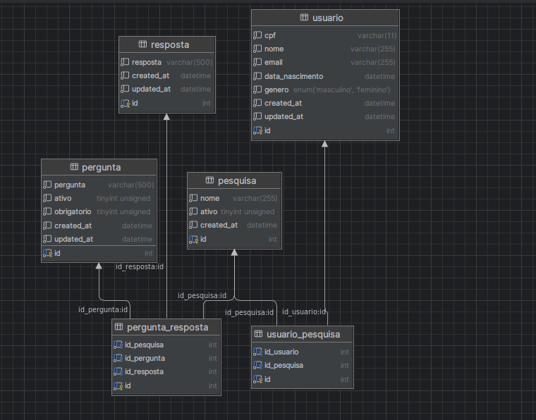

# Pesquisa Satisfação

// Incompleto - em andamento

A ideia da API foi pensando no google forms adicionando a associação e um usuário a diversos tipos de formulários de pesquisa.

### Usuário
No modulo de usuário será possivel criar, atualizar e listar usuários.

### Pesquisa
No modulo de pesquisa será possivel criar, atualizar e listar pesquisas.
Além disso seria interessante ativar ou desativar a pesquisa.

### Usuario_Pesquisa
No modulo de usuario_pesquisa será possivel criar, atualizar e listar a associação dos usuarios e quais pesquisas os usuários estão associados.
OBS: Fica aqui o questionamento adiciono aqui a coluna para avaliação de estrelas da pesquisa ou em outro canto, no momento a unica solução pensada foi em adicionar nessa tabela mesmo.

### Pergunta
No modulo de pergunta será possivel criar, atualizar e listar perguntas.
Além disso existe a funcionalidade de deixar uma pergunta ativada ou desativada e deixa-la ou não obrigatoria.

### Resposta
No modulo de resposta será possivel criar, atualizar e listar respostas.

### Pergunta_Resposta
No modulo de pergunta_respota será possivel criar, atualizar e listar as respostas que estão associadas as perguntas e pesquisas.
OBS: Isso aqui vai dar erro na associação de perguntas e pesquisa, o ideal é ter pesquisa_pergunta onde tem a associação das perguntas e pesquisas e depois ter pergunta_resposta onde só tenha a associação de perguntas e respostas.

---
OBS: Num futuro pode ser interessante separar usuários que estão cadastrados na loja e os que não estão cadastrados. No momento o pensamento é que o usuário não está cadastrado na loja

## To-Do List

- [x] Modelar Banco de Dados
- [x] Criar Modulo de cada tabela criada
- [x] Criar testes básicos
- [x] Colocar helmet para segurança de headers
- [x] Configurar Swagger e fazer documentação básica
- [ ] Criar Modulo para criação de pesquisa completa em que crie a pesquisa e as perguntas associadas a pesquisa.
- [ ] Criar Modulo para resposta de pesquisa em que usuário esteja associado
- [ ] Criar Migrations para criação automática de banco de dados
- [ ] Detalhar testes
- [ ] Detalhar swagger
- [ ] Separar a associação de pesquisas, perguntas e respotas de pergunta_resposta em duas tabelas (pesquisa_pergunta e pergunta_respota)
- [ ] Pensar melhor onde colocar a avaliação da pesquisa

